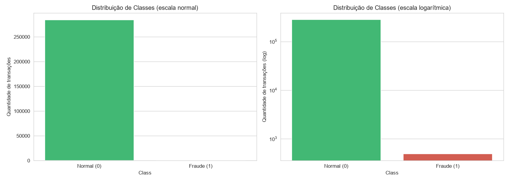
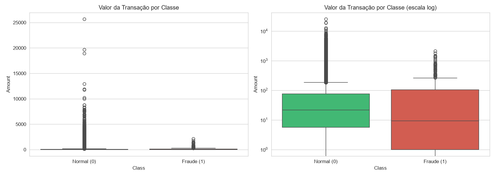
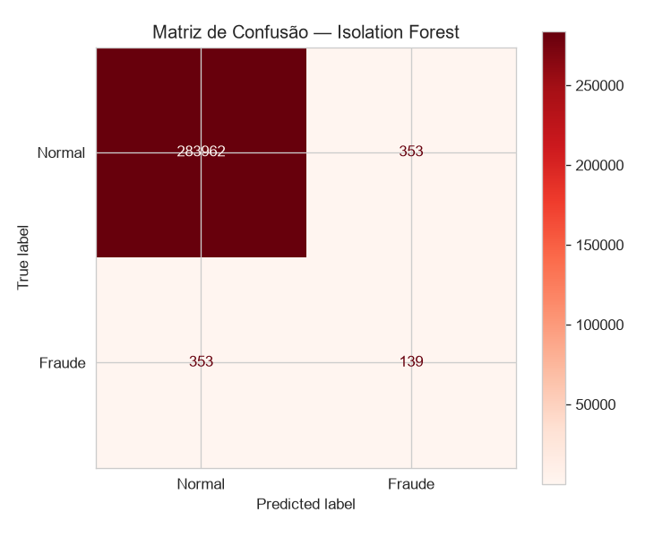
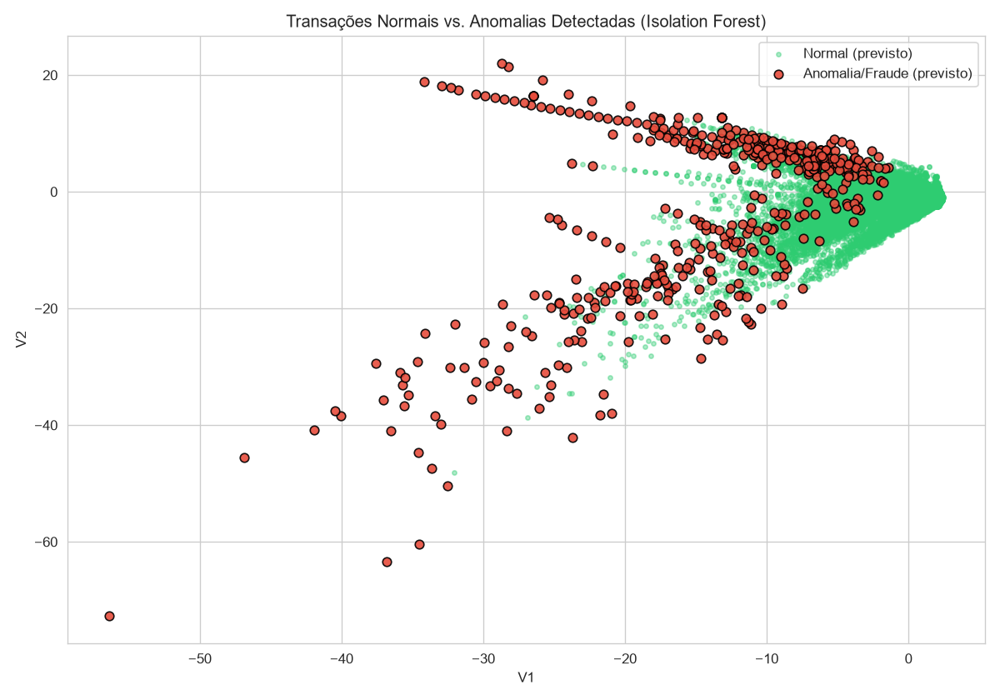
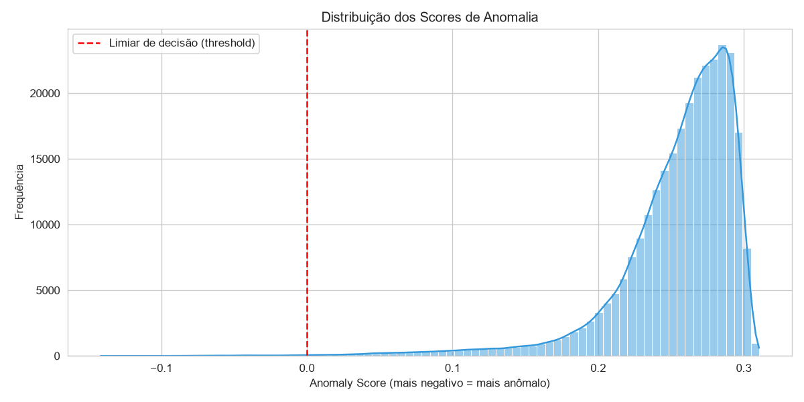

# Detecção de Anomalias em Transações Financeiras

Esse projeto foi desenvolvido como desafio do **Bootcamp DIO** (trilha de Dados/IA), simulando um problema real enfrentado por fintechs e bancos: identificar transações fraudulentas em tempo quase real, a partir do histórico de movimentações de cartão de crédito.

## Por que um projeto de Machine Learning no portfólio de um Analista de Dados/BI

Apesar da detecção de anomalias ser normalmente associada à Ciência de Dados, a lógica por trás dela é cada vez mais parte do dia a dia de Analistas de Dados e BI: identificar padrões fora da curva em relatórios financeiros, métricas operacionais, ou indicadores de negócio que fogem do esperado. A diferença não está na técnica em si, mas no contexto, pois aqui ela é aplicada a um problema de negócio real (fraude), com foco em explicar a decisão de métrica e o trade-off envolvido, da mesma forma que se justificaria a escolha de um indicador em um dashboard.

Esse projeto complementa o restante do portfólio (focado em Power BI e analytics) mostrando a capacidade de ir além do dashboard quando o problema pede, sem deixar de lado a parte que realmente importa para BI: comunicar o "porquê" de cada decisão, não só o "como".

## Por que esse projeto existe

Todo banco enfrenta o mesmo dilema: bloquear uma transação legítima irrita o cliente (e pode custar a conta); deixar passar uma fraude gera prejuízo direto. O modelo "ideal" não existe, existe um **equilíbrio** que a instituição escolhe tolerar.

Esse projeto reproduz esse dilema em miniatura: dado um histórico de ~284 mil transações de cartão de crédito, onde menos de 0,2% são fraudes, construir um pipeline que aprenda a separar o comportamento normal do atípico — e, principalmente, **medir o resultado com as métricas certas**, não com acurácia.

## O problema central: dados extremamente desbalanceados

Em sistemas financeiros reais, fraudes representam **menos de 1% do total de transações**. Isso quebra a intuição mais comum de quem está começando em ML: "meu modelo tem 99% de acurácia, deve estar ótimo".

Não está. Um modelo que simplesmente prevê "normal" para tudo, sem nunca avaliar nada, também teria ~99,8% de acurácia neste dataset — e zero capacidade de pegar fraude. É um modelo inútil escondido atrás de um número bonito.

Por isso, a primeira decisão de design deste projeto foi: **a acurácia nunca aparece como métrica de sucesso**. O que importa é:

- **Recall** — de todas as fraudes que realmente aconteceram, quantas o modelo conseguiu pegar? (o "custo" de errar aqui é a fraude que passa batido)
- **Precision** — das transações que o modelo acusou como fraude, quantas eram de fato fraude? (o "custo" de errar aqui é o cliente legítimo sendo incomodado)

Esses dois puxam em direções opostas, e a tensão entre eles é o coração do problema.

## Dataset

[**Credit Card Fraud Detection**](https://www.kaggle.com/datasets/mlg-ulb/creditcardfraud) —> disponibilizado publicamente no Kaggle.

- ~284.807 transações realizadas por cartões de crédito europeus em setembro de 2013
- Apenas **0,17%** das transações são fraudulentas
- Colunas `V1` a `V28`: variáveis numéricas anonimizadas, resultado de uma transformação PCA (por questões de confidencialidade dos dados originais)
- `Time`: segundos transcorridos desde a primeira transação do dataset
- `Amount`: valor da transação
- `Class`: variável-alvo (`0` = normal, `1` = fraude)

> O arquivo `creditcard.csv` **não está incluído neste repositório** por questões de tamanho (~150MB) e licenciamento. Baixe-o diretamente do Kaggle e coloque em `data/creditcard.csv` antes de executar o notebook.

## Por que Isolation Forest (e não outra coisa)

Existiam dois caminhos possíveis pra esse problema:

**Caminho A — Supervisionado** (Random Forest, XGBoost): treinar um classificador que aprende diretamente "isso é fraude" vs "isso não é", usando os rótulos (`Class`) do dataset. Funciona bem, mas depende de já ter exemplos rotulados de fraudes conhecidas e fraudes novas, com padrão diferente de tudo que já foi visto, podem escapar.

**Caminho B — Não supervisionado** (Isolation Forest, LOF): o modelo aprende **o padrão do normal**, sem nunca olhar o rótulo, e marca como anomalia tudo que se desvia muito desse padrão. Esse projeto seguiu esse caminho, porque é o que mais se aproxima do problema real: bancos não têm rótulo de "fraude" no momento em que a transação acontece — eles descobrem depois.

O **Isolation Forest** foi escolhido especificamente porque:

- Constrói várias árvores de decisão aleatórias e mede quão rápido cada ponto é "isolado" do resto
- Anomalias, por definição, são raras e diferentes — então são isoladas com poucas divisões. Pontos normais, parecidos entre si, exigem muito mais divisões pra serem isolados
- Escala bem mesmo com muitas variáveis (aqui temos 28 variáveis V1-V28 + Amount)
- Não exige balanceamento artificial dos dados (SMOTE, undersampling) pra funcionar, o que simplifica o pipeline

## Pipeline do Projeto

1. **Exploração e Limpeza de Dados (EDA)** — carregamento, verificação de nulos, análise do desbalanceamento de classes
2. **Engenharia de Recursos** — padronização da coluna `Amount` com `StandardScaler`
3. **Treinamento do Modelo** — `IsolationForest` do `scikit-learn`, com `contamination` ajustado à proporção real de fraudes
4. **Avaliação** — `classification_report`, matriz de confusão, com foco em **Recall** e **Precision**

### As duas decisões de feature engineering, e por quê

**`Amount` foi padronizado, `V1`-`V28` não.** As variáveis `V1` a `V28` já chegam padronizadas, são resultado de uma transformação PCA aplicada pelos autores do dataset antes da publicação (justamente para anonimizar os dados originais). `Amount`, porém, é o valor real da transação em reais/dólares, com uma escala completamente diferente (de centavos a milhares). Um algoritmo baseado em distância/isolamento trataria essa diferença de escala como se `Amount` fosse "mais importante" só por ter números maiores — por isso ele precisa ser padronizado antes de entrar no modelo.

**`Time` foi descartado.** A coluna representa apenas o número de segundos desde a primeira transação do dataset — é um índice temporal relativo, não um padrão comportamental (não diz nada sobre "hora do dia" ou "dia da semana", por exemplo). Incluí-la sem transformação adicionaria ruído ao invés de sinal.

## Resultados e como interpretá-los

| Métrica | O que mede | Por que importa no mundo real |
|---|---|---|
| **Recall** | De todas as fraudes reais, quantas o modelo conseguiu identificar | Recall baixo = fraudes passam direto, gerando prejuízo financeiro |
| **Precision** | Das transações marcadas como fraude, quantas realmente eram | Precision baixa = clientes legítimos têm cartão bloqueado sem motivo |
| **F1-score** | Média harmônica entre Recall e Precision | Resume o equilíbrio entre os dois extremos acima |

*(Os números exatos variam de acordo com a execução e com o dataset usado.)*

**Como ler isso na prática:** se o Recall ficar em, por exemplo, 85%, significa que de cada 100 fraudes reais, o modelo identificou 85 — e 15 passaram sem alerta. Se a Precision ficar em 30%, significa que para cada 10 alertas de fraude gerados, só 3 eram fraudes de verdade (os outros 7 são clientes legítimos sendo incomodados). Esse trade-off é controlado, entre outras coisas, pelo parâmetro `contamination` do Isolation Forest — aumentar esse valor tende a subir o Recall e baixar a Precision, e vice-versa.

### Resultado obtido com o dataset completo (284.807 transações, 492 fraudes reais)

| Métrica | Valor |
|---|---|
| Recall | **28,3%** |
| Precision | **28,3%** |
| F1-score | **0,283** |

**Leitura honesta desse número:** o modelo identificou 139 das 492 fraudes reais — deixando 353 passarem sem alerta (falsos negativos) e gerando outros 353 alertas falsos sobre transações legítimas (falsos positivos). Esse Recall é mais baixo do que o que abordagens supervisionadas (Random Forest, XGBoost) costumam atingir nesse mesmo dataset, geralmente acima de 80%.

Isso não é um bug — é uma limitação conhecida e documentada do Isolation Forest **não supervisionado** nesse problema específico: ele detecta pontos estatisticamente isolados no espaço de variáveis, mas uma fração relevante das fraudes reais desse dataset não se diferencia o suficiente das transações normais nas variáveis `V1-V28` para ser isolada dessa forma. Esse resultado, na verdade, é parte do aprendizado do projeto: mostra **por que** abordagens supervisionadas (ver "Próximos passos") tendem a performar melhor quando já existem rótulos históricos de fraude disponíveis — o que normalmente é o caso em produção.

**Como ler isso na prática:** o trade-off entre Recall e Precision é controlado, entre outras coisas, pelo parâmetro `contamination` do Isolation Forest — aumentar esse valor tende a capturar mais fraudes (subir o Recall), mas às custas de mais falsos positivos (Precision mais baixa), e vice-versa.

### O que cada gráfico mostra:

### Distribuição de Classes

Este gráfico mostra a quantidade de transações normais e fraudulentas presentes na base de dados. Na escala comum, quase nem é possível enxergar a barra das fraudes, porque existem apenas 492 fraudes contra 284.315 transações normais. Isso ajuda a entender o principal desafio do problema: os casos de fraude são muito raros. Por isso, usar apenas a acurácia para avaliar o modelo pode ser enganoso, já que ele poderia acertar quase tudo simplesmente classificando todas as transações como normais. A versão em escala logarítmica serve apenas para tornar essa diferença mais fácil de visualizar.

### Valor da Transação por Classe

Esses boxplots comparam os valores das transações normais e fraudulentas. Dá para perceber que as fraudes costumam apresentar uma distribuição de valores um pouco diferente das transações comuns, além de terem uma variação maior. Isso sugere que o valor da transação pode fornecer pistas úteis para identificar uma fraude, embora, sozinho, ele não seja suficiente para fazer essa distinção.

### Matriz de Confusão

A matriz de confusão resume o desempenho do modelo mostrando quantas transações ele classificou corretamente e onde ele cometeu erros. Com ela é possível ver quantas fraudes foram detectadas, quantas passaram despercebidas e quantas transações normais foram marcadas como suspeitas. A partir desses números são calculadas métricas importantes, como Recall e Precision, que ajudam a avaliar a eficiência do modelo.

### Transações Normais vs. Anomalias Detectadas

Neste gráfico, cada ponto representa uma transação usando duas das variáveis do conjunto de dados (V1 e V2). As transações consideradas anômalas pelo modelo aparecem destacadas em vermelho. Embora o modelo utilize todas as variáveis disponíveis para tomar suas decisões, essa visualização ajuda a entender, de forma mais intuitiva, como ele separa os casos considerados normais daqueles que parecem suspeitos.

### Distribuição dos Scores de Anomalia

Este histograma mostra a pontuação de anomalia atribuída pelo modelo a cada transação. Quanto mais negativa essa pontuação, maior a chance de a transação ser considerada uma fraude. A linha vermelha representa o limite usado para decidir se uma transação será classificada como normal ou anômala. Como a maioria das transações é legítima, grande parte das pontuações fica do lado considerado normal, enquanto apenas uma pequena parcela aparece na região de anomalias.

## Instalando e executando

### Pré-requisitos

- **Python 3.9 ou superior** instalado. Para verificar, rode no terminal:
  ```bash
  python3 --version
  ```
  Se aparecer "command not found", no Windows use `python --version` no lugar de `python3` ao longo deste guia.

- **Git** instalado (para clonar o repositório). Verifique com `git --version`.

- Conta gratuita no [Kaggle](https://www.kaggle.com/) (para baixar o dataset).

### Passo 1 — Clonar o repositório

```bash
git clone https://github.com/seu-usuario/deteccao-anomalias-transacoes.git
cd deteccao-anomalias-transacoes
```

### Passo 2 — Criar e ativar um ambiente virtual (recomendado)

Isso evita conflito com outras bibliotecas Python já instaladas na sua máquina.

```bash
python3 -m venv venv
```

Ativar o ambiente:

```bash
# Linux / macOS
source venv/bin/activate

# Windows (PowerShell)
venv\Scripts\Activate.ps1

# Windows (CMD)
venv\Scripts\activate.bat
```

Você vai saber que funcionou porque o terminal passa a mostrar `(venv)` no início da linha.

### Passo 3 — Instalar as dependências

```bash
pip install -r requirements.txt
```

### Passo 4 — Baixar o dataset

1. Acesse [kaggle.com/datasets/mlg-ulb/creditcardfraud](https://www.kaggle.com/datasets/mlg-ulb/creditcardfraud)
2. Clique em **Download** (pode pedir login — é gratuito)
3. Extraia o `.zip` baixado
4. Mova o arquivo `creditcard.csv` para dentro da pasta `data/` deste projeto

A estrutura final da pasta `data/` deve ficar assim:
```
data/
└── creditcard.csv
```

### Passo 5 — Abrir e executar o notebook

```bash
jupyter notebook deteccao_anomalias_transacoes.ipynb
```

Isso abre o Jupyter no navegador. Dentro dele, vá no menu **Cell → Run All** (ou **Kernel → Restart & Run All**) para executar o notebook do início ao fim.

> 💡 Se preferir, também é possível abrir o notebook direto no **VS Code** (com a extensão "Jupyter" instalada) ou no **Google Colab** (fazendo upload do `.ipynb` e do `creditcard.csv`).

### Problemas comuns

| Erro | Causa provável | Solução |
|---|---|---|
| `jupyter: command not found` | Jupyter não foi instalado ou o ambiente virtual não está ativado | Confirme que o `(venv)` aparece no terminal e rode `pip install -r requirements.txt` novamente |
| `FileNotFoundError: data/creditcard.csv` | Dataset não foi baixado ou está no lugar errado | Repita o Passo 4 e confirme que o arquivo está exatamente em `data/creditcard.csv` |
| `ModuleNotFoundError: No module named 'sklearn'` | Dependências não instaladas no ambiente certo | Verifique se o ambiente virtual está ativado antes de rodar `pip install -r requirements.txt` |
| Erro ao ativar o `venv` no Windows (PowerShell) | Política de execução de scripts bloqueada | Rode `Set-ExecutionPolicy -Scope CurrentUser RemoteSigned` no PowerShell e tente ativar novamente |
| Gráficos não aparecem no notebook | Backend do Matplotlib mal configurado (raro) | Adicione `%matplotlib inline` no início da primeira célula de código |

## Estrutura do repositório

```
deteccao-anomalias-transacoes/
├── data/
│   └── creditcard.csv          # baixar do Kaggle (não incluso)
├── images/                     # gráficos exportados pelo notebook
├── deteccao_anomalias_transacoes.ipynb
├── requirements.txt
└── README.md
```

## Próximos passos

- Comparar `Isolation Forest` com `Local Outlier Factor (LOF)`
- Testar abordagem supervisionada (Random Forest / XGBoost) com balanceamento via `SMOTE`
- Ajustar o parâmetro `contamination` e avaliar o impacto no trade-off Recall/Precision
- Implementar validação cruzada

## Tecnologias

- Python
- Pandas / NumPy
- Scikit-learn
- Matplotlib / Seaborn
- Jupyter Notebook

---

Projeto desenvolvido para o desafio **"Detecção de Anomalias em Transações"** do Bootcamp [DIO](https://www.dio.me/).
